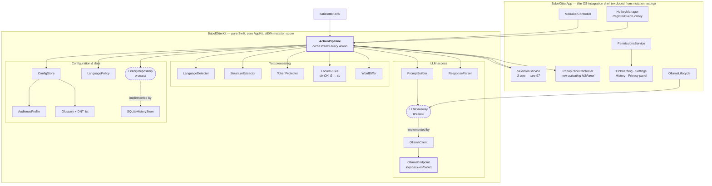
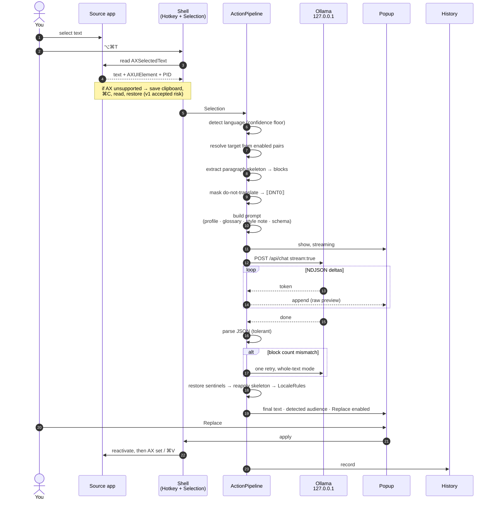
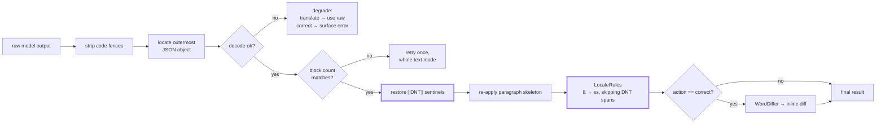
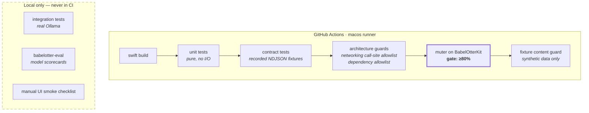

# babelOtter — Architecture

Status: **proposed, awaiting approval**. Companion to
[`superpowers/specs/2026-09-18-babelotter-design.md`](superpowers/specs/2026-09-18-babelotter-design.md).

---

## 1. Trust boundary

Everything inside the dashed boundary is on your machine. The single crossing
is made by the Ollama daemon, on your explicit confirmation, and carries only a
model name — never user content.

**The key property:** babelOtter never opens a non-loopback socket. When a model
is missing it calls `POST 127.0.0.1:11434/api/pull`; the *daemon* performs the
download. The "exactly one networking call site, loopback-enforced" invariant
therefore holds with no exceptions, and is asserted by an architecture test.

---

## 2. Component architecture

Protocol seams (`LLMGateway`, `HistoryRepository`, and the detector) are what
let the core be tested without Ollama, a database, or a running macOS UI.

---

## 3. Request flow — the Translate action

Note step ordering after generation: sentinel restoration **precedes** locale
rules, and locale rules must not rewrite restored do-not-translate tokens. Both
are explicit invariants with dedicated tests — and prime mutation targets.

---

## 4. Post-processing chain

---

## 5. Testing topology

Integration and eval runs stay local for two reasons: CI runners have no models,
and no real text may ever execute on a third-party runner from a public repo.

---

## 6. Decisions and their rationale

| Decision | Why | Cost accepted |
|---|---|---|
| Pure core + thin shell | Makes logic testable and privacy invariants provable | Protocol boilerplate at the seam |
| One process, no daemon/XPC | Single-user tool; IPC is unjustified complexity | No cross-restart persistence of in-flight work |
| `RegisterEventHotKey` | Avoids the Input Monitoring permission entirely | Carbon-era API |
| Non-activating `NSPanel` | Source app keeps focus, selection survives | Fiddly positioning and key handling |
| Block-array responses | Structure mismatch becomes detectable, not silent corruption | Stricter prompt, retry path needed |
| Stream raw, post-process at end | Feels fast while staying correct | Replace stays disabled until finalised |
| Delegate model pulls to Ollama | Preserves loopback-only invariant | Depends on daemon being reachable |
| Mutation gate on core only | UI-glue mutants are noise | Shell correctness rests on manual smoke tests |

### Known risks

1. ~~**Focus loss.**~~ **RESOLVED by measurement (#30, 2026-09-19).** A
   non-activating `NSPanel` keeps the source app frontmost, the captured
   `AXUIElement` stays valid across the panel's lifetime, and the selection
   survives. Verified end to end in TextEdit: capture → panel → re-activate →
   write back. This was the highest risk in the design and it does not
   materialise. See §7 for what the same spike *did* overturn.
2. **`muter` maturity.** May not run cleanly on Swift 6.4 / macOS 27.
   **Spike in M0.** Fallback: a SwiftSyntax-based in-house harness. Last resort:
   report-only — which would be reported, not quietly adopted.
3. **Sentinel fidelity.** Models may mangle `⟦DNT0⟧` markers. Needs empirical
   validation across candidate models via the eval harness.
4. **Clipboard fallback vs Universal Clipboard.** Knowingly accepted for v1;
   see [`../PRIVACY.md`](../PRIVACY.md).

---

## 7. Selection capture — measured, not assumed

Everything in this section replaces the earlier "Accessibility API, else
clipboard" model, which was wrong. It was corrected by spike #30, run against
real applications on macOS 27 on 2026-09-19.

### Three tiers, not two

| Tier | Mechanism | Works in | Measured |
|---|---|---|---|
| 1 | `kAXSelectedTextAttribute` | Native AppKit | TextEdit ✅ read + write |
| 2 | `AXSelectedTextMarkerRange` → `AXStringForTextMarkerRange` (parameterized) | WebKit | Safari, Mail HTML view ✅ read |
| 3 | Clipboard simulation | Electron, and anywhere tier 1–2 return empty | VS Code |

WebKit surfaces return `noValue` for `kAXSelectedTextAttribute` and expose the
selection through **text markers** instead. Missing tier 2 means treating Safari
and Mail as clipboard-only, which is both less private and less reliable than
necessary.

### `AXUIElementSetAttributeValue` lies

On Mail's read-only HTML view, setting `kAXSelectedTextAttribute` returns
`.success` and **changes nothing**. Measured directly.

**The replace step must read the selection back and compare before reporting
success.** A caller trusting the return code tells the user "Replaced" over
untouched text — the exact failure story #34 exists to prevent, with the false
signal originating in the OS rather than in our code. Only a verified match may
report success; anything else falls through to the next tier or surfaces the
failure.

### Attribute presence is not capability

VS Code's focused element reports `AXRole = AXTextArea`,
`AXRoleDescription = editor`, and advertises `AXSelectedText`,
`AXSelectedTextRange`, `AXSelectedTextRanges` **and** `AXSelectedTextMarkerRange`.
With text genuinely selected, all three read paths return empty. Monaco renders
the editor itself and exposes only a hidden `<textarea>` input shim.

**Capability detection must attempt a real capture and require a non-empty
result.** Probing for attribute *names* classifies VS Code as tier 1; it is
tier 3. This is the single most misleading result the spike produced.

### Electron needs accessibility enabled in advance

Chromium keeps its accessibility tree switched off until an assistive tool asks.
Setting `AXManualAccessibility` on the application element returns `success`, but
the tree is built **asynchronously**: the first capture afterwards still fails
with `noValue`, and a later one succeeds.

So this must be enabled **when an Electron app is first seen frontmost**, not at
capture time. Enabling at capture time makes every Electron app look permanently
unreachable — which is precisely what the first prototype concluded.

Note this switches on accessibility work inside applications we do not own. That
is ordinary behaviour for assistive software and is what VoiceOver does, but it
is a side effect worth stating rather than burying.

### Consequence for the accepted clipboard risk

`PRIVACY.md` accepts a Universal Clipboard exposure for v1 on the assumption that
the clipboard is a rare fallback. The measurements say otherwise: it is the only
path for Electron, and the only path for replacement into web content. The M4
strict-mode work (#77) is therefore more load-bearing than its milestone suggests
and is worth reconsidering for v1.

### MDM does not block the grant

Measured on 2026-09-20 with `Tools/ax-probe.sh`, on a managed work Mac:
DEP-enrolled, MDM enrolment user-approved, several vendor PPPC payloads
present (including ones that pre-authorise Accessibility for management and
remote-support tools), and the user holding local admin.

`AXIsProcessTrusted()` returned **YES** after granting Accessibility to a
terminal through System Settings. **So M1b's premise holds.** The PPPC
payloads on that machine pre-authorise specific vendor tools; they do not
prevent the user granting Accessibility to something of their own.

This was section 7's largest open risk -- if the grant had been blocked, no
capture tier would work and M1b would have had no premise at all. It is
closed. Two caveats worth keeping: local admin was required to make the grant,
and a policy refresh could in principle re-apply and revoke it, so #71
(re-present setup when a permission is revoked) is not hypothetical.

### Per-app tiers, measured on the managed machine

Measured 2026-09-20 with `Tools/ax-probe.sh`, selections made by hand.

| App | Focused role | Tier 1 | Tier 2 | Verdict |
|---|---|---|---|---|
| TextEdit | `AXTextArea` | OK, 77 chars | unsupported | **Tier 1** |
| Preview | `AXGroup` | OK, 46 chars | unsupported | **Tier 1** |
| Outlook (message body) | `AXTextArea` | OK, 20 chars | OK, 20 chars | **Tier 1** |
| Safari (page body) | `AXWebArea` | `noValue` | OK, 213 chars | **Tier 2** |
| Microsoft Teams | `AXWindow` | unsupported | unsupported | **Tier 3** |
| Microsoft Word | `AXSplitGroup` | unsupported | unsupported | **Tier 3** |
| Microsoft OneNote | `AXScrollArea` | unsupported | unsupported | **Tier 3** |
| VS Code | no element | `noValue` | `noValue` | **Tier 3** |

**Tier 2 earns its place.** Safari with a selection in the body of a page gives
`noValue` for `kAXSelectedTextAttribute` and 213 characters through
`AXSelectedTextMarkerRange` → `AXStringForTextMarkerRange`. Without tier 2,
Safari is clipboard-only.

**A container role means the reading is invalid, not that the app is tier 3.**
Outlook first measured as `AXWindow` with nothing readable, and on a second
attempt -- with the selection genuinely inside a message body -- came back
`AXTextArea` and read cleanly on both tiers. The first reading was of a window
whose focus was not in text. Anything reporting `AXWindow`, `AXSplitGroup` or
`AXScrollArea` should be re-measured before being believed.

**Teams, Word and OneNote are tier 3 on this evidence.** All three focus a
container, support neither attribute on it, and a breadth-first walk of up to
400 descendants found nothing selectable below it. Two caveats, stated because
the conclusion is load-bearing: a 400-node breadth-first budget is not proof
that nothing exists deeper, and the Outlook lesson above means a container role
always deserves a second attempt. But three Microsoft apps behaving identically,
after Outlook proved the probe can find text when it is there, is reasonable
evidence.

**`AXManualAccessibility` is `attributeUnsupported` on Outlook and Teams**, so
the Chromium arming path in item 4 does not apply to them, whatever they are
built from. An element did appear on the retry after that failed arming, and an
earlier version of the probe credited the arming for it; the extra wait was the
only thing that changed.

### Write-back, measured

Spike #30 measured writes on the private machine: verified in TextEdit, a
silent no-op on Mail's read-only HTML view. It left editable web content
untested -- tier 2 read proven, tier 2 write not. Measured 2026-09-20, same
machine, with `Tools/ax-probe.sh --write`:

| Surface | Focused role | Read | Write |
|---|---|---|---|
| TextEdit | `AXTextArea` | tier 1, 11 chars | **WRITE OK** (control) |
| Safari `<textarea>` | `AXTextArea` | tier 1, 129 chars | **success returned, value unchanged** |
| Mail message body | `AXWebArea` | tier 2, 16 chars | **success returned, value unchanged** |
| Safari smart search field | `AXComboBox` | tier 1 and 2, 21 chars | **success returned, value unchanged** |

**WebKit does not honour selection writes, even where it reads perfectly.** A
plain `<textarea>` in Safari reads 129 characters through `kAXSelectedText`,
accepts a write, returns `.success`, and changes nothing. That is the case
spike #30 flagged as untested, and the answer is no.

Four web surfaces have now lied the same way -- read-only Mail, editable Mail,
a Safari textarea, and Safari's search field -- against a TextEdit control that
passed in the same run. This is not a property of read-only content, and it is
not the probe.

**Read and write have different tier maps, and this is the design consequence.**
An app can be tier 1 for reading and tier 3 for writing; Safari's textarea is
exactly that. The ladder in #31 and #33 must therefore be evaluated separately
per direction. A capability probe that establishes "tier 1 works here" during
capture says nothing about replacement, and assuming otherwise is how the user
gets told "Replaced" over untouched text.

So `FR-CAP-04`'s clipboard fallback for writes is not an edge case: **for every
web surface and every Electron app, the clipboard is the only way to put a
result back.** AX write is confirmed working only in native AppKit text.

**Still untested for writes:** Outlook's message body, which reads as a native
`AXTextArea` and is the one work-critical surface that might accept an AX
write; Notes; Pages. One round each, whenever convenient.

### What this means for the clipboard

The spike said the clipboard is common rather than rare. These measurements say
something sharper: **for the applications this user actually works in, the
clipboard is the majority path.** Teams, Word, OneNote and VS Code are all tier
3. Outlook, Safari, TextEdit and Preview are not.

So #77's strict Accessibility-only mode does not shave off an edge case. Turning
it on would make babelOtter refuse to operate in Teams, Word and OneNote
altogether. That is a defensible choice for someone who wants the guarantee
absolute, and it is a very different product for someone who does not -- which
makes the default a real product decision rather than a detail, and makes the
setting itself worth having either way.

### A terminal cannot measure itself

The same run also produced six readings of the terminal the probe was
launched from, all `cannotComplete`. That is not a finding about capture; it
is the probe's own design fault, since a fixed countdown assumed the reader
would switch apps on its schedule. The probe now waits for a foreign app to
settle before reading.

Worth keeping anyway: a GPU-rendered terminal answered `cannotComplete`
(-25204) rather than `attributeUnsupported` or `noValue`. The tier ladder has
to treat "the app never answered" as tier 3, the same as an empty result --
another case of #31's rule that capability is decided by attempting a capture,
never by asking what is supported.

### Not yet measured

Chrome; the focus-taking panel variant (#52); whether Word or Teams expose text
deeper than a 400-node walk reaches; and replacement, which has been measured
nowhere -- every reading above is a read. Item 2 warns that
`AXUIElementSetAttributeValue` returns success for writes that do nothing, and
that has not been re-confirmed on this machine.
