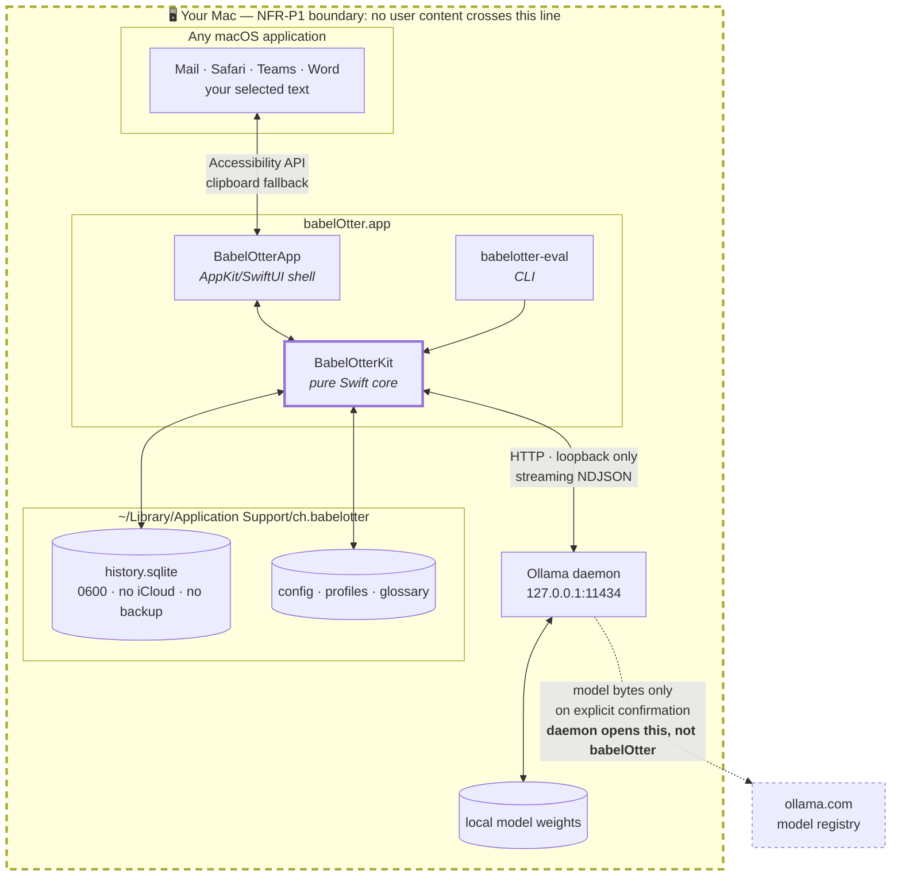
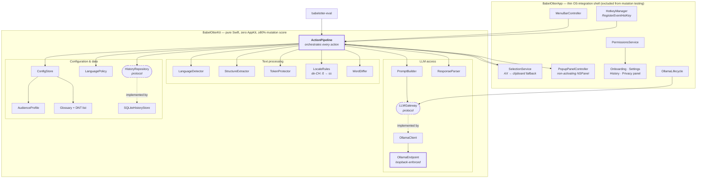
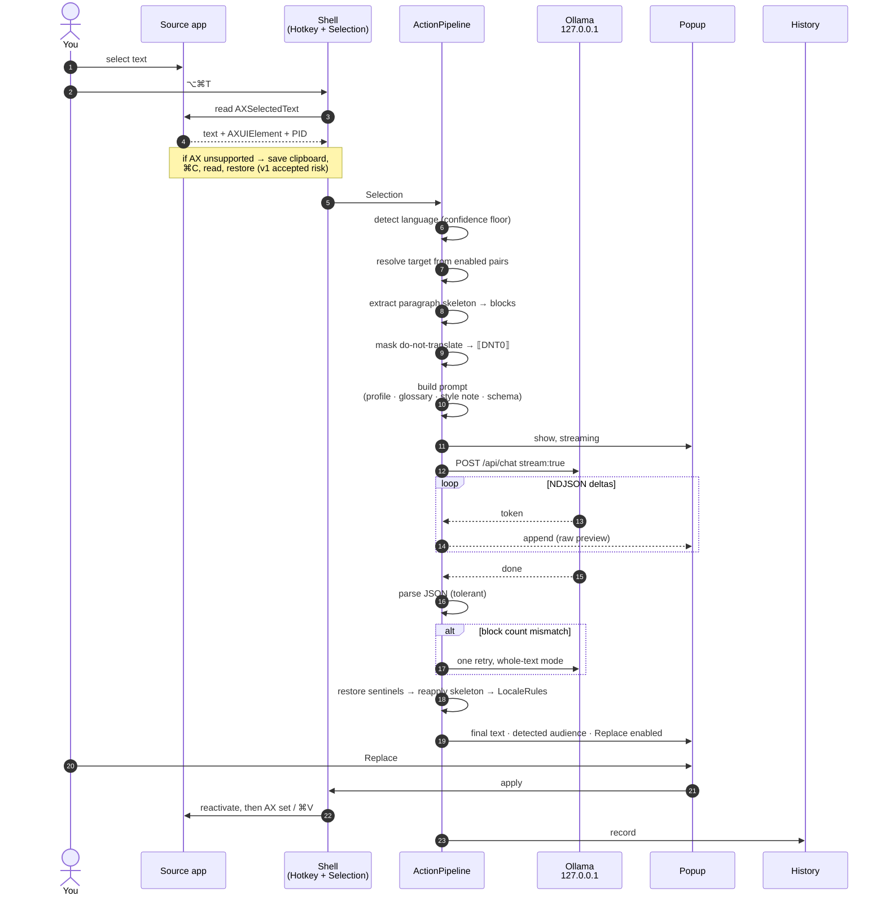
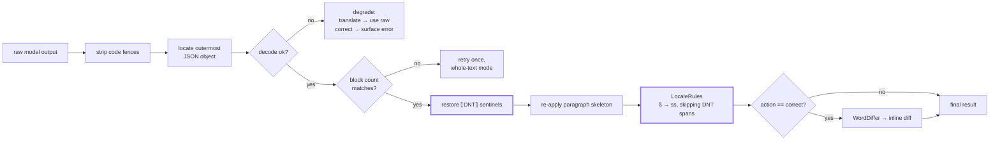
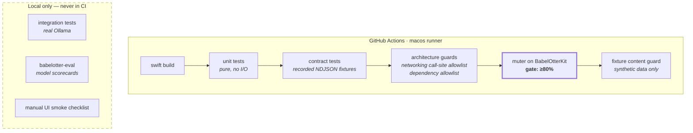

# babelOtter — Architecture

Status: **proposed, awaiting approval**. Companion to
[`superpowers/specs/2026-09-18-babelotter-design.md`](superpowers/specs/2026-09-18-babelotter-design.md).

---

## 1. Trust boundary

Everything inside the dashed boundary is on your machine. The single crossing
is made by the Ollama daemon, on your explicit confirmation, and carries only a
model name — never user content.

**The key property:** babelOtter never opens a non-loopback socket. When a model
is missing it calls `POST 127.0.0.1:11434/api/pull`; the *daemon* performs the
download. The "exactly one networking call site, loopback-enforced" invariant
therefore holds with no exceptions, and is asserted by an architecture test.

---

## 2. Component architecture

Protocol seams (`LLMGateway`, `HistoryRepository`, and the detector) are what
let the core be tested without Ollama, a database, or a running macOS UI.

---

## 3. Request flow — the Translate action

Note step ordering after generation: sentinel restoration **precedes** locale
rules, and locale rules must not rewrite restored do-not-translate tokens. Both
are explicit invariants with dedicated tests — and prime mutation targets.

---

## 4. Post-processing chain

---

## 5. Testing topology

Integration and eval runs stay local for two reasons: CI runners have no models,
and no real text may ever execute on a third-party runner from a public repo.

---

## 6. Decisions and their rationale

| Decision | Why | Cost accepted |
|---|---|---|
| Pure core + thin shell | Makes logic testable and privacy invariants provable | Protocol boilerplate at the seam |
| One process, no daemon/XPC | Single-user tool; IPC is unjustified complexity | No cross-restart persistence of in-flight work |
| `RegisterEventHotKey` | Avoids the Input Monitoring permission entirely | Carbon-era API |
| Non-activating `NSPanel` | Source app keeps focus, selection survives | Fiddly positioning and key handling |
| Block-array responses | Structure mismatch becomes detectable, not silent corruption | Stricter prompt, retry path needed |
| Stream raw, post-process at end | Feels fast while staying correct | Replace stays disabled until finalised |
| Delegate model pulls to Ollama | Preserves loopback-only invariant | Depends on daemon being reachable |
| Mutation gate on core only | UI-glue mutants are noise | Shell correctness rests on manual smoke tests |

### Known risks

1. **Focus loss.** Showing the popup can deactivate the source app and drop the
   selection. Mitigated by capturing the `AXUIElement` and PID at trigger time
   and using a non-activating panel. **De-risking spike in M0** — this is the
   most likely thing to make the app feel broken.
2. **`muter` maturity.** May not run cleanly on Swift 6.4 / macOS 27.
   **Spike in M0.** Fallback: a SwiftSyntax-based in-house harness. Last resort:
   report-only — which would be reported, not quietly adopted.
3. **Sentinel fidelity.** Models may mangle `⟦DNT0⟧` markers. Needs empirical
   validation across candidate models via the eval harness.
4. **Clipboard fallback vs Universal Clipboard.** Knowingly accepted for v1;
   see [`../PRIVACY.md`](../PRIVACY.md).
